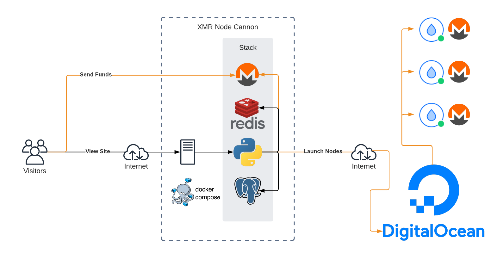

# xmr-node-cannon-do

This is a web service that allows anonymous visitors to fund the launch of public Monero nodes onto Digital Ocean's compute infrastructure. The service will autonomously organize, execute, and track launches and payouts for the operators and participants (moneronauts?).

Send XMR to host a named Monero node for the world to see and use. New nodes can provision on the fly and bootstrap their configurations and Monero blockchain; comes with operational dashboards w/ metrics.

Pricing fluctuates and is determined by the market price of XMR and the amount of hours the server was running (since last payout). Payouts are run every few hours and come out of each launches' wallet account balance.

## Technical Details

This is a Python app (Flask) which relies on relational and key-value data stores; PostgreSQL and Redis today. It uses `docker-compose` for both development and production. For development use the flask web server (`flask run`) and for production use `gunicorn` and `nginx`. Run the Monero wallets as a direct CLI invocation `docker run` to run the latest Monero release from a Docker container image (lalanza808/monero:latest). Run 2 containers in succession; an init (to generate and show seeds) and RPC (to maintain open RPC port).

Most of this is simplified with helper scripts BASH scripts (./bin/*) invoked via `make`.

Most of the user facing pages use Redis cache as an intermediary so as to not overwhelm the wallet RPC service; direct API calls go in `app.library.x.y` (where x is the thing, coingecko, monero, digitalocean, etc, y is function/method name) and cached versions go in `app.library.cache.y` (where y is the function/method name).

## Running

### Setup

Use the provided Makefile to provision stuff; pass `prod` or `dev` depending on your environment.

* Run `cp env-example .env && vim .env` to create a secrets file for the app and containers. Be sure to edit it's contents with the proper secrets.
* Run `make dev-up` to stand up development infrastructure (pg, redis, rpc wallet).
* Run `make dev` to run the development web server.
* Run `make prod-up` to stand up production infrastructure (pg, redis, rpc wallet).
* Run `make prod` to run production web server.
* Run `make init` to apply base database schemas.

### Secrets

All secrets are passed to the application as environment variables which are loaded from `.env` in the root directory. The `config.py` file references env vars or uses a default; docker-compose and the app consume secrets from `.env`.

### Monero Node Initialization

Nodes are configured using a user data/cloud-init script in the [docker-monero-node](https://github.com/lalanza808/docker-monero-node/blob/master/cloud-init.sh) repo.

User data is defined in `app.library.digitalocean.create_droplet` method.

### Digital Ocean Backend

Digital Ocean configuration can be found here: [Digital Ocean](docs/DigitalOcean.md)

### Hosting

You can host this service on any provider, it just needs to have a Digital Ocean account and token to operate correctly.

### Background Tasks

Currently tasks are handled by the OS via `crontab` of the user running the web service. Use the provided [crontab.txt](crontab.txt) file to set it: `sudo -u monero crontab ~/xmrcannon/crontab.txt` (assumes you've cloned to ~/xmrcannon)

The tasks right now are for 1. launching new nodes that have received funding (`launch_funded_operations`) and 2. performing payouts (`process_payouts`).
