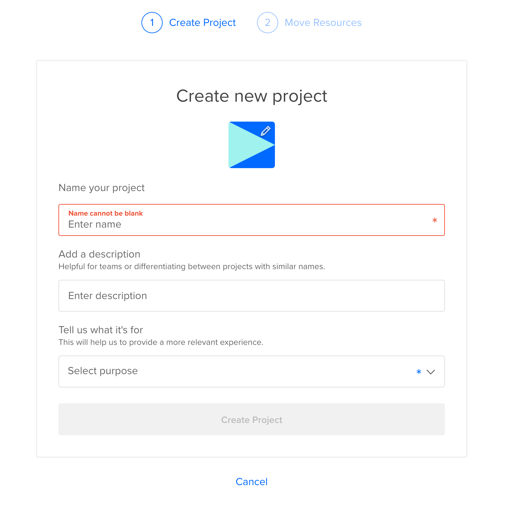
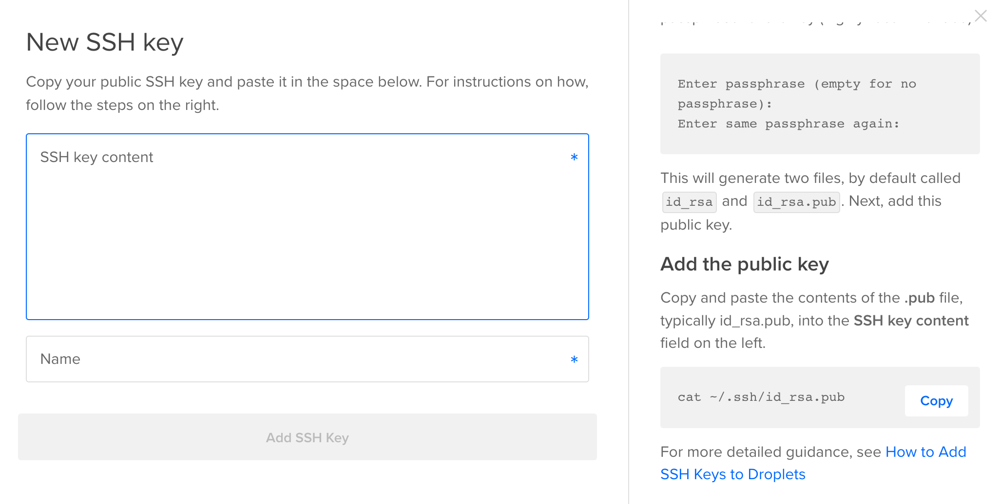
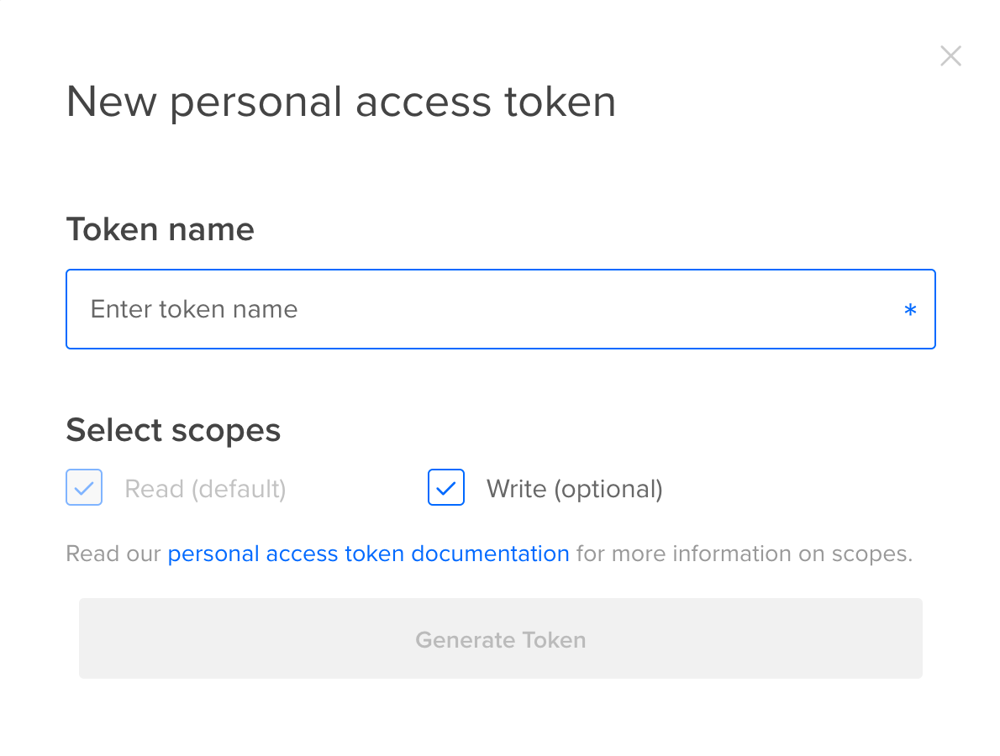
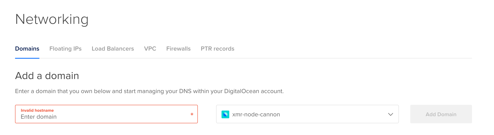

# Digital Ocean Integration

## Setup

### DO Account
You will need to setup a Digital Ocean (DO) account to set this up: [Register with DO](https://cloud.digitalocean.com/registrations/new)

Upon getting your account, you will want to create a new project which will be referenced for all of the node launches.

### SSH

In the DO console, navigate to [Settings -> Security](https://cloud.digitalocean.com/account/security) and click `Add SSH Key` to add an SSH you will use to manage the launched nodes via SSH. Follow the instructions provided on the screen.

### API Token

In the DO console, navigate to [API -> Tokens/Keys](https://cloud.digitalocean.com/account/api/tokens) and click `Generate New Token` to create an API token. You will need tokens for local development and production usage.

### Domain

You will need to register a domain with some registrar and update your Name Servers to DO's in the [Networking -> Domains](https://cloud.digitalocean.com/networking/domains) console in order to let DO manage DNS.

